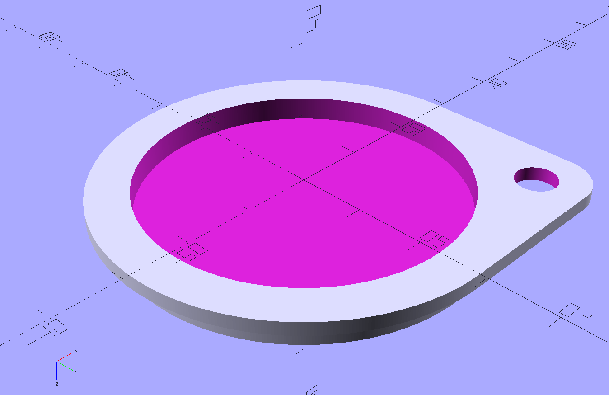

# LeansCap Nikon

A replacement lens cap for the Nikon Action 16x50 4.1° binoculars, designed in OpenSCAD and prepared for 3D printing.

This project was created as an alternative to the original objective lens cover and can be printed on standard FDM 3D printers.

## Compatibility

- Binocular model: Nikon Action 16x50 4.1°
- Type: Front objective lens cap

## Features

- Designed in OpenSCAD
- Fully parametric and customizable
- Ready-to-print `.stl` model included
- Simple and fast 3D printing
- Lightweight construction
- Easy tolerance adjustment

## 3D Printing

### Recommended Settings

Trust your slicer, almost plug and play just add auto supports

## License

MIT License

